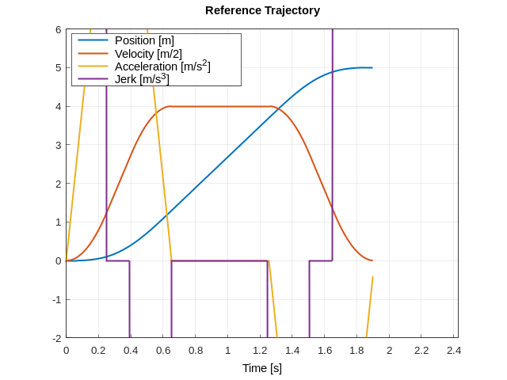
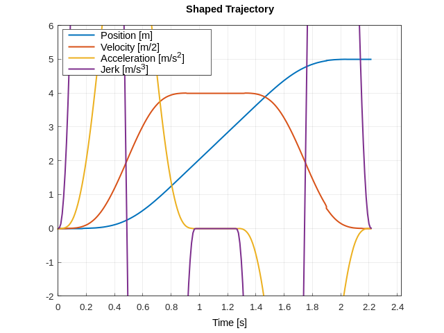

<p align="center">
  
</p>

# About
A flexible input shaping library utilizing nested simple moving averages (SMA).

nested-shaper is designed to smooth trajectories by transforming lower-order polynomial trajectories into higher-order polynomial trajectories.

- [Explore the docs](https://timetravelcat.github.io/nested-shaper/) for detailed explanation.
- C++14 [header-only](https://en.wikipedia.org/wiki/Header-only) library.
- Standard C++ library is not required.
- Static memory allocation in order to store samples.
- Average of euclidean or angle space. (WIP on RotationMatrix)
- Cumulative and Recursive implementations.
- Tests with [Catch2](https://github.com/catchorg/Catch2). (*BUILD_TESTING*)
- Examples using [ruckig](https://github.com/pantor/ruckig) and [Matplot++](https://github.com/alandefreitas/matplotplusplus). (*BUILD_EXAMPLE*)
- User customizable data types and average metrics. (See Advanced Guide section of [docs](https://timetravelcat.github.io/nested-shaper/))

<p align="center">
  
  
</p>

# Installation
**nested-shaper** has no dependencies except examples and testing(both are disabled by default). nested-shaper follows general steps of cmake configuration and build.

## Option 1. System installation & cmake 
```bash
mkdir -p build
cd build
cmake .. -DCMAKE_BUILD_TYPE=Release # -DBUILD_TESTING=ON -DBUILD_EXAMPLE=ON
make
# (sudo) make install # if you want system-wide installation
```

```CMake
find_package(nested-shaper REQUIRED)
add_executable(myapp main.cpp)
target_link_libraries(myapp PRIVATE nested-shaper::nested-shaper)
```

## Option 2. CMake FetchContents
```CMake
include(FetchContent)
FetchContent_Declare(nested-shaper GIT_REPOSITORY
https://github.com/timetravelCat/nested-shaper)
FetchContent_MakeAvailable(nested-shaper)
...
target_link_libraries(myapp PRIVATE nested-shaper)
```

## Option 3. Copy & Paste
Copy include/nested-shaper folder to your project. The only thing you need is C++14 compiler.

# Tutorials
```cpp
#include <nested-shaper/NestedShaper.hpp>

using namespace ns;

...
/**
 * First template argument "double" is your data type. If you need array type, you need to use NestedShaperEuclideanRecursiveArray with extra template arguments.
 * 
 * Second argument "5" means nested_shaper outputs position, velocity, acceleration, jerk, snap.
 * If you use "1", only outputs position.
 * Recommends to use "1", "3", "5", "7", "9", for better accuracy of derivatives.
 * 
 * Left template arguments defines maximum filter sizes.
 * In this example, there are total 3 nested filters.
 * 
 * Constructor requires at least one arguments. 
 * If one argument provided, the nested shaper is initialized with the given argument as initial position.
 * Or Constructor can provided with 1 + (total filter numbers). You can resize filter size(less than template parameter) dynamically.
 * 
 * Same behavior with constructor during runtime, by initialize() method is supported.
 **/
NestedShaperEuclideanRecursive<double, 5, FIRST_FILTER_SIZE, SECOND_FILTER_SIZE, THIRD_FILTER_SIZE> nested_shaper{3.0f};

/**
 * convolute accepts reference trajectory position and dt as arguments.
 * dt must be constant.
 * 
 * shaped_trajectory_point stores position, velocity, acceleration, jerk, snap.
 **/
array<double, 5> shaped_trajectory_point = nested_shaper.convolute(5.0, 0.01);
```

## Code examples
- **1D** euclidean : [euclidean_step.cpp](examples/euclidean_step.cpp)
- **1D** euclidean, jerk limited trajectory as input : [euclidean_trajectory.cpp](examples/euclidean_trajectory.cpp)
- **3D** euclidean, jerk limited trajectory as input : [euclidean_array.cpp](examples/euclidean_array.cpp)
- Common alias classes : [NestedShaper.hpp](include/nested-shaper/NestedShaper.hpp)

## Limitations
- Trajectory must be initialized with a arbitrary position and zero of its derivatives.

- **nested-shaper** can not initialized with a moving start trajectory point.

- Delta time must be same, during entire shaping process

- Maximum supported derivate order : 9 (See [central_finite_difference_coefficients.hpp](include/nested-shaper/metrics/central_finite_difference_coefficients.hpp))

# License
This project is licensed under the [BSD-3-Clause](https://opensource.org/license/bsd-3-clause) - see the
[LICENSE](LICENSE) file for details

# Contact
timetravelCat - timetraveler930@gmail.com