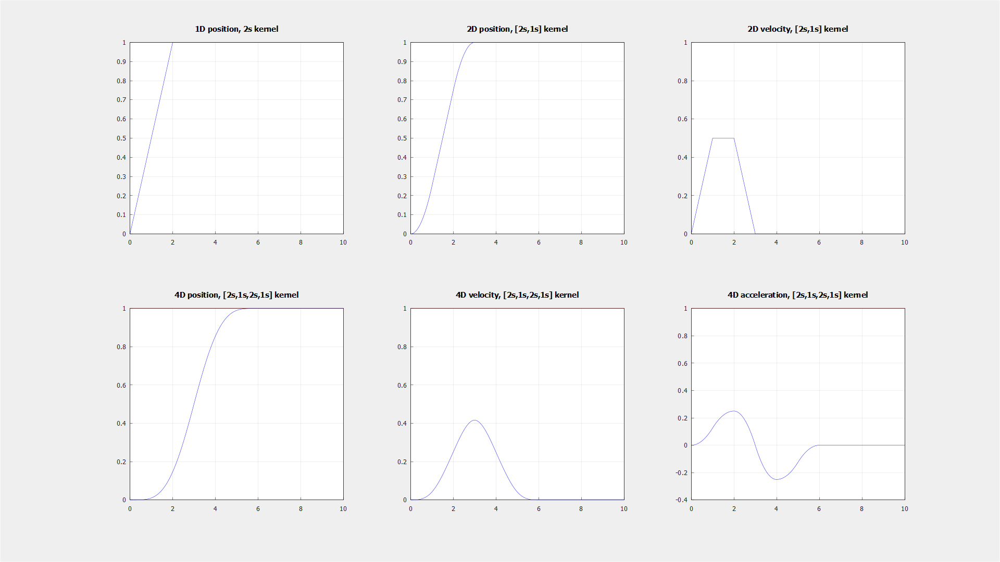
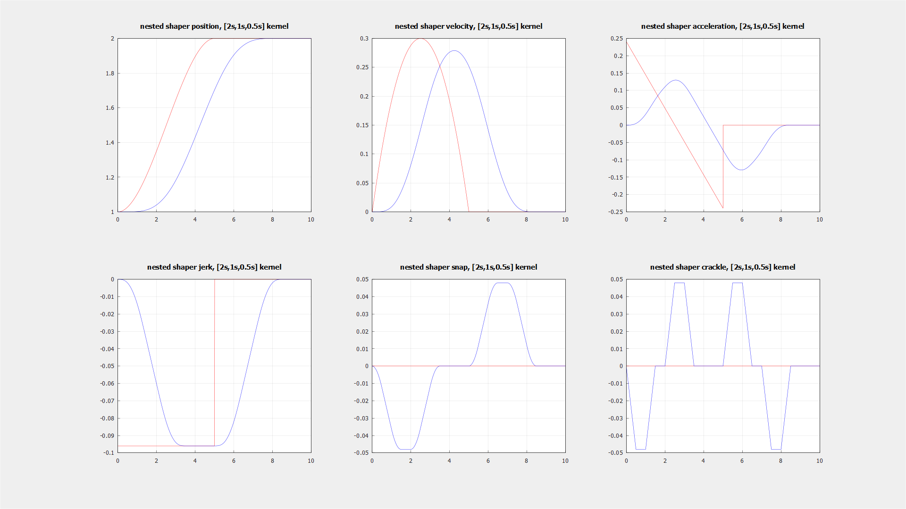

# nested-shaper
An **input-shaping** library using **nested** *moving average filter*.

Main purpose of this library is generating realtime higher-order trajectory from lower-order trajectory.

## *Step input example*

- Step input case - **position = 0 if t < 0**, **position = 1 if t >= 0**, **velocity = acceleration = ... = 0**
- 1D moving average filter kernel(left top) generates continuous position.
- 2D moving average filter kernel(middle top, right top) generates continuous velocity.
- 4D moving average filter kernel(left, middle, right down) generates continuous jerk. (second order acceleration)

----------
## *Trajectory input example*

- Assume input trajectory is given as 
    - p(t) = 1.0 + 0.12*t^2 - 0.016*t^3 
    - v(t) = 0.24*t - 0.048*t^2         
    - a(t) = 0.24 - 0.096*t             
    - j(t) = - 0.096                    
    - assume v, a, j is 0 if t < 0 or t > 5, (p is 2 if t > 5)
- Apply 3D moving average filter for trajectory input
    - Results continuous crackle.

## Features
- **Header only** library
- Requires C++ compiler only, supports C++11 standard. (libstdc++/libc++ is not necessary)
- No dynamic allocation. All required queue memory for moving average filter will be resided in stack area.

## Limitations
- (Input) Trajectory must start with zero velocity, zero acceleration, zero jerk...
- Update dt should be constant.

## Getting Started
Nested shaper provides 2 primary classes 
- **nested_filter** *<typename **T**, size_t **Depth**, bool **Recursive**, SummatorType **summatorType**, size_t... **Capacities**>*

    ```cpp
    #include <nested-shaper/nested_shaper.hpp>
    using namespace ns;
    ...

    // Declare nested_filter with 3 depth(allows retrieve acceleration), 2-nested moving average filter, max sized with 100 and 200 each.
    nested_filter<double, 3, true, SummatorType::KBN, 100, 200> _input_shaper;
    _input_shaper.resize(50, 100); // Supports resize of moving average filters, sized with 50, 100 each. This resets the filter.
    _input_shaper.fill(1.0); // Fill all internal moving average filter data as 1.0, meaning initial position as 1.0, with zero velocity, acceleration, jerk ...
    _input_shaper.update(2.0); // Push input position with 2.0
    const double* output = _input_shaper.peek(0.01); // Update delta time is 10ms. Output is shaped [position, velocity, acceleration] array.
    ```

- **nested_shaper** *<size_t **Channel**, typename **T**, size_t **Depth**, bool **Recursive**, SummatorType **summatorType**, size_t... **Capacities**>*
    ```cpp
    #include <nested-shaper/nested_shaper.hpp>
    using namespace ns;
    ...

    // Declare nested_shaper with 3 channel(requires pos, vel, acc input), 4 depth (allows retrieve [Channel + Depth -1] dimension output, pos, vel, acc, jerk, snap, crackle), max sized with 3-order nested moving average filter with 100, 50, 50 each.
    nested_shaper<3, double, 4, true, SummatorType::KBN, 100, 50, 50> _input_shaper{50, 25, 25}; // Constructor calls resize of nested filters.
    // 3 channel requires pos, vel, acc input, except special cases, vel, acc **should be zero**
    const double initial_condition[] = {1.0, 0.0, 0.0};
    _input_shaper.fill(initial_condition);
    const double input_trajectory[] = {1.0005, 0.1, 10};
    _input_shaper.update(input_trajectory);
    const double* output = _input_shaper.peek(0.01); // Update delta time is 10ms. Output is shaped [position, velocity, acceleration, jerk, snap, crackle] array.
    ```
If **Recursive** is true, moving average filter calculated with recursion. If new data arrives, **(new data - old data)/size is added to internal summator**. Otherwise, if new data arrives, average is calculated by **iterating all internal data queue**. If recursive is enabled, filter is vulnerable to numerical error, when large scale filter required or long time operation required. In order to avoid numerical error, **SummatorType** is provided.

**SummatorType** is consists of 3 type (Naive, KahanBabushkaNeumaierSum(KBN), KahanBabushkaKleinSum(KBK)), refer from https://en.wikipedia.org/wiki/Kahan_summation_algorithm. 

If you are working on constrained workspace, and has limited computational resources, I recommend enables recursion and uses KBN summator. Abbreviation classes are provided, nested_filterf, nested_filterd, nested_shaperf, nested_shaperd.

Algorithm speed will be

[**Recursive**, **Naive**] > [**Recursive**, **KBN**] > [**Recursive**, **KBK**] >>> [**Non-Recursive**, **Naive**] > [**Non-Recursive**, **KBN**] > [**Non-Recursive**, **KBK**]

Other useful classes are provided. (used for implementing nested_shaper)
- Simple 1D moving average filter. Refer **average_filter.hpp**
- RingBuffer based queue. Refer **sized_queue.hpp**

### Prerequisites
* **C++ Compiler** - needs to support at least the **C++11** standard, i.e. *MSVC*, *GCC*, *Clang*
* **CMake v3.15+** if you want to install system-wide library.
> ***Note:*** *You also need to be able to provide ***CMake*** a supported
[generator](https://cmake.org/cmake/help/latest/manual/cmake-generators.7.html).*

### Installation from sources
- *nested-shaper* is header-only library.
    - Copy include/** to your project.
- If you want to install system-wide, requires **CMake v3.15+**
    ```bash
    cmake -Bbuild -DCMAKE_INSTALL_PREFIX=$(INSTALL_LOCATION)
    cmake --build build --config Release
    cmake --build build --target install --config Release
    ```
    
### Unit Test
- *nested-shaper* uses [Catch2](https://github.com/catchorg/Catch2) for using testing.
- Turn on the CMake **BUILD_UNIT_TEST** option

### Examples
- *nested-shaper* uses [Matplot++](https://github.com/alandefreitas/matplotplusplus) for examples (for algorithm visualization).
- Turn on the CMake **BUILD_EXAMPLES** option
- Install gnuplot and add bin folder to your PATH.

## License
This project is licensed under the [Unlicense](https://unlicense.org/) - see the
[LICENSE](LICENSE) file for details

## Contact
timetravelCat - timetraveler930@gmail.com