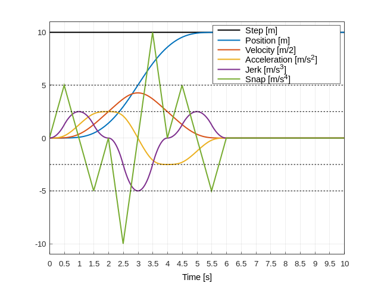

# Theory inside nested-shaper

### Definitions of [Convolution](https://brianmcfee.net/dstbook-site/content/ch10-convtheorem/ConvolutionTheorem.html)

$$
h(t) = \int_{-\infty}^{\infty}f(x)g(t-x)dx=f(t)*g(t) \tag{continuous domain}
$$

$$
h[n] = (f*g)[n]=\sum_{i=0}^{K-1}f[k] \cdot g[n-k] \tag{discrete domain}
$$

----------------------------------------------

### The Convolution Theorem

$$
h = f * g \iff H[m] = F[m] \cdot G[m] \iff H(s)= F(s)G(s)
$$

----------------------------------------------

### Step and SMA function in frequency domain

Step function, defined by

$$
u(t)=\begin{cases}
0 & \text{if } t < 0 \\
A & \text{if } t \geq 0 \\
\end{cases} \to U(s)=\mathcal{L}\{u(t)\}=\frac{A}{s} \tag{1}
$$

SMA function, defined by

$$
\text{SMA}_k(t)=\frac{1}{T_k}(H(t)-H(t-T_k)) \to \text{SMA}_k(s) = \mathcal{L}\{SMA_k(t)\} = \frac{1}{T_k}(\frac{1-e^{T_ks}}{s}) \tag{2}
$$

Heaviside unit step, defined by

$$
H(t)=\begin{cases}
1 & \text{if } t \geq 0 \\
0 & \text{if } t < 0 \\
\end{cases}
$$

----------------------------------------------

### [Laplace transforms](https://www.vyssotski.ch/BasicsOfInstrumentation/LaplaceTransform.pdf) used in this theory

$$
\mathcal{L}\{t^{n}\}=\frac{n!}{s^{n+1}} \tag{3}
$$

$$
\mathcal{L}\{H(t-a)\}=\frac{e^{-as}}{s}\ (a \geq 0) \tag{4}
$$

$$
\mathcal{L}\{f(t-a)H(t-a)\}=e^{-as}\mathcal{L}\{f(t)\} \tag{5}
$$

----------------------------------------------

## Step function with nested SMA.

Based on the convolution theorem, we apply nested SMAs(total n) on step function. 
$$
R(s)=U(s)\text{SMA}_1(s)\text{SMA}_2(s)\cdots\text{SMA}_n(s)
$$

$$
=\frac{A}{s^{n+1}}\frac{1}{T_1T_2\cdots T_n}(1-e^{T_1s})(1-e^{T_2s})\cdots (1-e^{T_ns})=\frac{A}{n!}\frac{n!}{s^{n+1}}\frac{1}{\prod^{n}_{k=1}T_{k}}\prod^{n}_{k=1}(1-e^{T_ks})
$$

$$
=\frac{A}{n!}\frac{n!}{s^{n+1}}\frac{1}{\prod^{n}_{k=1}T_{k}}\sum^{n}_{k=0}(-1)^k\sum_{\stackrel{I\subseteq\{1,2,\cdots,n\}}{|I|=k}}e^{-s\sum_{i\in I}T_i} \tag{6}
$$

If SMAs have same amplitude, 

$$
R(s)=U(s)\text{SMA}^n(s)=\frac{A}{n!}\frac{n!}{s^{n+1}}\frac{1}{T^n}\sum^n_{k=0}(-1)^k\binom{n}{k}e^{-kTs} \tag{7}
$$

Apply inverse laplace transform on (7), in case of all SMAs have same amplitude, for simplicity.

$$
r(t)=\mathcal{L^{-1}}\{R(s)\}=\frac{A}{n!}\frac{1}{T^n}\sum^n_{k=0}(-1)^k\binom{n}{k}(t-kT)^nH(t-kT) \tag{8}
$$

Let's investigate first Heaviside section.

$$
r(t)=\frac{A}{n!}\frac{1}{T^n}t^n\ (t \leq T) \tag{9}
$$

And we can prove important characteristics about derivatives.

$$
\therefore \frac{d^k r(t)}{dt^k} = \frac{A}{(n-k)!T^n}t^{n-k}\ (\leq \frac{A}{T^k}) \tag{10}
$$

(10) implies the derivative of results, is always smaller than initial amplitude / nested SMA's amplitude. 

If we generalize the results in case of SMAs have different amplitude, and first sections, 

$$
\frac{d^k r(t)}{dt^k} \leq \frac{A}{\prod_{n=1}^{k} T_{n}}
$$

Here is an example, step input with **10.0**, applied with 5 filters,
SMA amplitude with **2.0s, 2.0s, 1.0s, 0.5s, 0.50**

You can see that, (first section, see **t < 2.0s**)

*Velocity*      <= 10.0 / 2.0 = 5.0

*Acceleration*  <= 10.0 / (2.0\*2.0) = 2.5

*Jerk*          <= 10.0 / (2.0\*2.0\*1.0) = 2.5

*snap*          <= 10.0 / (2.0\*2.0\*1.0\*0.5) = 5.0

----------------------------------------------

### Implementation details about SMA
The mean over last N data-points calculated as 

$$
y[n] = \frac{1}{N}\sum_{i=0}^{N-1}x[n-i] \tag{11}
$$

Iterating all over the N data points is computationally expensive. 
However, averaging all data at each time will provide a numerically stable results in long time calculation.
Other way to calculate SMA is (called as recursive/cumulative),

$$ 
y[n+1] = y[n] + \frac{1}{N}(x[n+1]-x[n-k+1])
$$

Calculating SMA by cumulative method suffers from numerical error on long time operation. 
In order to minimize numerical error, i implemented [Kahan summation algorithm](https://en.wikipedia.org/wiki/Kahan_summation_algorithm). 

----------------------------------------------

### averaging angles.
What if samples are on the different algebra space? For example, we should use [circular mean](https://en.wikipedia.org/wiki/Circular_mean) for angle. 

$$
\bar{\alpha} = \text{atan2}(\frac{1}{n}\sum^n_{j=1} \text{sin} (\alpha_{j}), \sum^n_{j=1} \text{cos} (\alpha_{j}))
$$

----------------------------------------------